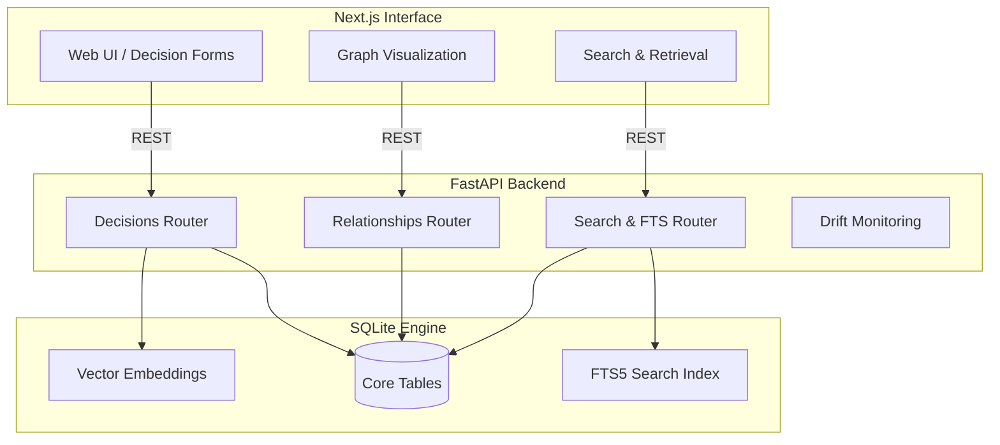

# GraphNous

> A Cognitive Infrastructure Platform for Organizational Decision Memory.

GraphNous is designed to act as an external cognitive system that captures, structures, and retrieves organizational context, architectural decisions, and the underlying assumptions that drive them. By structuring informal reasoning into a retrievable graph, GraphNous prevents knowledge churn and architectural drift.

---

## 🧠 Cognitive Science Philosophy

GraphNous is built on several foundational concepts from cognitive science, organizational behavior, and human-computer interaction. It isn't just a database; it is an **extended cognitive system** for your organization.

### 1. The Extended Mind (Clark & Chalmers, 1998)
The Extended Mind Theory posits that cognitive processes are not confined to the brain but extend into the environment through tools and systems. GraphNous serves as a reliable, external memory store, allowing teams to offload the cognitive burden of remembering complex rationales and shifting assumptions into a shared, querying environment.

### 2. Distributed Cognition (Hutchins, 1995)
Knowledge in a complex environment (such as an engineering organization) is distributed across individuals, artifacts, and tools. GraphNous acts as the central artifact that continually synchronizes this distributed state, ensuring that when an individual leaves a project, the cognitive context remains accessible to the team.

### 3. Organizational Memory & The Forgetting Curve (Walsh & Ungson, 1991; Ebbinghaus)
Organizations suffer from localized forgetting—knowledge learned during system design is quickly lost after the system is deployed. GraphNous counteracts the "Ebbinghaus Forgetting Curve" by creating a durable, searchable graph of *why* decisions were made, not just *what* was built.

### 4. Cognitive Load Theory (Sweller, 1988)
By externalizing the tracking of interconnected constraints, evidence, and assumptions, GraphNous reduces the intrinsic and extraneous cognitive load on engineers. This enables them to focus their working memory on solving novel problems rather than reconstructing historical context.

---

## 🏗️ Architecture

GraphNous is designed using a decoupled architecture, with a Python/FastAPI backend functioning as the cognitive engine and a Next.js React frontend serving as the interface for knowledge elicitation and retrieval.



### Core Components

1. **Frontend (Next.js / React)**
   - Delivers a highly responsive UI with interactive forms for structured decision capture.
   - Provides visual interfaces for exploring decision graphs and searching historical context.

2. **Backend Engine (Python / FastAPI)**
   - `routers/decisions.py`: Manages the lifecycle of decisions, capturing rationale, alternatives, confidence, and owner details.
   - `routers/search.py`: Implements aggressive retrieval via FTS5 (Full-Text Search) and vector/similarity mechanisms.
   - `routers/graph.py`: Maps relationships between decisions (Edges), handling the structural linkage.
   - `routers/drift.py`: Monitors "drift"—when assumptions made in the past differ from current realities.

3. **Storage Layer (SQLite / Turso libsql)**
   - **Schema**: Tables for `decisions`, `assumptions`, `evidence`, `signals`, and `edges`.
   - **FTS5 Indexing**: High-performance full-text search over decision rationale and assumptions.
   - **Embeddings**: Vector blob storage for semantic similarity matching (extensible to LLM embedding models like `bge-small` via Turso or local embedding functions).

---

## 🚀 Getting Started

### Prerequisites
- Node.js (v18+)
- Python (3.10+)

### Backend Setup
1. Navigate to the `backend` directory.
2. Create a virtual environment and activate it:
   ```bash
   python -m venv .venv
   source .venv/bin/activate  # On Windows: .venv\Scripts\activate
   ```
3. Install dependencies from `requirements.txt` (if present) or `pip install fastapi uvicorn sqlite3 ...`.
4. Run the API:
   ```bash
   uvicorn main:app --reload --port 8000
   ```

### Frontend Setup
1. Navigate to the `frontend` directory.
2. Install dependencies:
   ```bash
   npm install
   ```
3. Run the development server:
   ```bash
   npm run dev
   ```
4. Access the GraphNous interface at `http://localhost:3000`.

---

## 📚 Recommended Reading (Foundations)

- Clark, A., & Chalmers, D. (1998). *The extended mind*. Analysis, 58(1), 7-19.
- Hutchins, E. (1995). *Cognition in the Wild*. MIT press.
- Walsh, J. P., & Ungson, G. R. (1991). *Organizational memory*. Academy of management review, 16(1), 57-91.
- Sweller, J. (1988). *Cognitive load during problem solving: Effects on learning*. Cognitive science, 12(2), 257-285.
